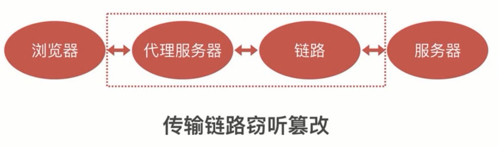

# 前后端漏洞分析与防御


## 前端 XSS

### XSS 介绍

**什么是 XSS**

> XSS 全称 Cross Site Script，跨站脚本攻击，是一种代码注入攻击。攻击者通过在目标网站上注入恶意脚本，使之在用户的浏览器上运行。利用这些恶意脚本，攻击者可获取用户的敏感信息如 Cookie、SessionID 等，进而危害数据安全。


**XSS 能干什么**

* 获取页面数据 (偷取网站任意数据)
* 获取 Cookies (偷取用户资料 / 偷取用户密码和登录态)
* 劫持前端逻辑
* 发送请求 (欺骗用户)

**XSS 攻击类型**

* **反射型**

  也叫非持久型XSS，是指发生请求时，XSS代码出现在请求URL中，作为参数提交到服务器，服务器解析并响应。响应结果中包含XSS代码，最后浏览器解析并执行。

  ```
  反射型攻击步骤
  1. 攻击者构造出特殊的 URL，其中包含恶意代码。
  2. 用户打开带有恶意代码的 URL 时，网站服务端将恶意代码从 URL 中取出，拼接在 HTML 中返回给浏览器。
  3. 用户浏览器接收到响应后解析执行，混在其中的恶意代码也被执行。
  4. 恶意代码窃取用户数据并发送到攻击者的网站，或者冒充用户的行为，调用目标网站接口执行攻击者指定的操作。
  ```

* **存储型** (危害较大)

  也叫持久型XSS，主要是将XSS代码发送到服务器（不管是数据库、内存还是文件系统等。），然后在下次请求页面的时候就不用带上XSS代码了。

  ```
  // 存储型攻击步骤
  1. 攻击者将恶意代码提交到目标网站的数据库中。
  2. 用户打开目标网站时，网站服务端将恶意代码从数据库取出，拼接在 HTML 中返回给浏览器。
  3. 用户浏览器接收到响应后解析执行，混在其中的恶意代码也被执行。
  4. 恶意代码窃取用户数据并发送到攻击者的网站，或者冒充用户的行为，调用目标网站接口执行攻击者指定的操作。
  ```


### XSS 攻击的注入点

**HTML 节点内容注入**

如果一个节点的内容是动态生成的，内容是用户的信息，那么这些输入的信息里就可能会包含脚本从而导致 XSS 攻击

```html
// 假如下面是用户发表评论的输入框
<div>
	#{content}
</div>
// 在输入框中输入脚本，就可以注入到页面中去
<div>
    <script></script>
</div>
```


**HTML 属性注入**

若某一个 HTML 节点的某个属性，是由用户输入的数据组成的，那么这个用户输入的数据有可能也会包含脚本

```html
// 这个 img 为动态生成的数据

// 用户先输入了 1"，提前关闭了 src 属性，然后在后面接上了自己的脚本 onerror="alert(1)"

```


**Javascript 代码注入**

js 代码中存在由后台注入的变量，或者包含了用户输入的信息，这时有可能这些信息会改变 js 代码的逻辑

```javascript
<script>
    // 这个 data 给出的数据是由服务器给出的，这个数据有可能是用户自己输入的脚本
    var data = "#{data}";
	// 和 html 属性注入类似，提前关闭了 data 变量，再注入了自己的脚本
    var data = "hello";alert(1);"";
</script>
```


**富文本编辑器**

富文本即 html ，如网站常用的文章编辑器等，输入文字后实际上是转成了 html 代码。从上面三种情况看来，只要是 html 就有 XSS 攻击的风险。


### XSS 攻击的防御

**浏览器自带防御**

防御的是反射型的 XSS ，参数出现在 html 内容或属性中就会进行拦截

```
这种手段十分有限，无法防御 js 注入等 XSS 攻击，而且并不是所有浏览器都支持 XSS 防御
```

 

**HTML 节点内容和属性防御**

* 节点内容防御

  如果用户在内容中输入了 html 代码，就把代码中的 < 和 > ，替换成转义字符 &lt 和 &gt，直接显示出来 

* 属性防御

  HTML 属性能够注入脚本是因为输入了单引号或双引号，提前关闭了属性，只要我们**将用户输入的单引号或双引号用其对应的转义字符替换**就好了。

  ```
  需要注意的是，HTML 的属性其实是可以不需要加单双引号的，那么这时候如果要关闭属性，就得使用空格，因此还要把空格也转义。一般在代码编写中 html 属性都要记得加上引号
  ```

```javascript
var escapeHtml = function(str) {
    if(!str) return '';
    str = str.replace(/&/g,'&amp;');
	str = str.replace(/</g,'&lt;');
	str = str.replace(/>/g,'&gt;');
    str = str.replace(/"/g,'&quto;');
    str = str.replace(/'/g,'&#39;');
    return str;
}
```


**JavaScript 代码防御**

1. 将数据中的引号进行转义，但 js 代码无法解析转义字符，所以要再进行转义

```javascript
str = str.replace(/"/g,'\\"') // 斜杠本身也需要转义
```

2. 对变量使用 Json.stringify，会全部转义 


**富文本防御**

* 按白名单保留部分标签和属性

将 html 解析成树状结构，再在数据结构中按白名单进行过滤，然后再组装成 html

```javascript
// 使用 cheerio 将 html 代码解析成树状结构
// 定义白名单
// 根据过滤
var xssFilter = function(html) {
    if(!html) return '';
    var cheerio = require('cheerio');
    var $ = cheerio.load(html);
	var whiteList = {
        'img':['src'],
        'font':['color','size'];
        'a':['href']
    }
    $('*').each(function(index,elem) {
        if(!whiteList(elem.name)) { // 判断这个属性在白名单中是否存在，不存在则移除
            $(elem).remove()；
            return;
        }
        for(var attr in elem.attribs) {
            whiteList[elem.name].indexOf(attr) === -1{
                $(ele.).attr(attr,null);
            }
        }
    });
    console.log(html,$.html())
    return $.html()
}
```

```javascript
// 可以使用现成的 xss 库来进行防御
var xssFilter = function(html) {
    if(!html) return '';
    var xss = require('xss');
    var ret = xss(html);
    return ret;
}
```


* 使用黑名单属性进行过滤(没白名单好)

```javascript
var xssFilter = function(html){
    if(!html) return;
    html = html.replace(/<\s*\?script\s*>/g,'');//将script 标签替换为空
    html = html.replace(/javascript:[^'"]*/g,'');//将属性中出现的 javascript 后的代码替换为空
    return html;
}
```


### CSP 

CSP (Content Security Policy) 内容安全策略，用于指定哪些内容可执行

```javascript
content.setHeader('Content-Security-Policy', )
```


## 前端 CSRF

### CSRF 介绍

> CSRF（Cross-site request forgery）跨站请求伪造，攻击者诱导受害者进入第三方网站，在第三方网站中，向被攻击网站发送跨站请求。利用受害者在被攻击网站已经获取的注册凭证，绕过后台的用户验证，达到冒充用户对被攻击的网站执行某项操作的目的。


### CSRF 攻击原理

1. 用户登录`a.com`并**保留登录信息**(cookie)
2. 攻击者**引诱用户访问**了`b.com`
3. `b.com`在用户不知情的情况下向`a.com`发送请求并携带用户的登录信息
4. `a.com`接收请求验证登录信息通过执行某些恶意操作
5. 攻击者在用户不知情的情况下冒充用户的身份完成了攻击.


### CSRF 攻击类型

* GET 类型的 CSRF

  例如利用隐藏图片或者超链接自动发起一个 HTTP 请求,会自动附带用户 cookies

  ```html
  
  ```

* POST 类型的 CSRF

  例如利用隐藏表单自动提交

  ```html
  <form action="https://www.test.com/xxx" method=POST>
      <input type="hidden" name="account" value="xiaoming" />
      <input type="hidden" name="amount" value="10000" />
  </form>
  <script> document.forms[0].submit(); </script> 
  ```

* 链接类型的 CSRF

  如常见的利诱广告方式或者冒充QQ病毒警告等引诱用户自己点击

  ```html
  <a href="https://www.test.com/xxx" taget="_blank">
    一刀9999级,神级装备,顶级神宠,开服就有！！
  <a/>
  ```


### CSRF 攻击的防御

**CSRF 攻击的特征**

* B 网站向 A 网站请求
* 带 A 网站 Cookies
* 不访问 A 网站前端
* referer 为 B 网站


**禁止第三方网站带 Cookies**

利用 Cookies 的 same-sites 属性

```
Set-Cookie: key=value; SameSite=Strict/Lax
```

```
缺点：1. 兼容性差 2. 不支持子域名
```


**禁止来自第三方网站的请求**

服务端验证客户端请求中的 referer 字段

```javascript
var referer = ctx.request.headers.referer;
if(!/^https?:\/\/localhost/.test(referer)) {
    throw new Error('非法请求')
}
```


**在前端页面加入验证信息**

利用 CSRF 攻击不访问 A 网站前端的特性，在前端页面加入验证信息，如验证码或者 token 等

* **验证码**

```
npm install ccap // 生成图形验证码的包
```

* **设置 token**

1. 当用户首次登录成功之后, 服务端会生成一个唯一性和随机性的 token 值保存在服务器的 Session 或者其他缓存系统中，再将这个token值返回给浏览器；
2. 浏览器拿到 token 值之后本地保存；
3. 当浏览器再次发送网络请求的时候,就会将这个 token 值附带到参数中(或者通过Header头)发送给服务端；
4. 服务端接收到浏览器的请求之后,会取出 token 值与保存在服务器的Session 的 token 值做对比验证其正确性和有效期。


## 前端 Cookie 问题

### Cookie 特性

* 前端的数据存储
* 前端可读可写
* 后端可通过 http 请求头设置
* 前端请求时可通过 http 头传给后端
* **遵守同源策略**

* 有效期：cookie 没有提供删除的 api ，可通过手动设置 expire 有效期来删除 cookie
* 路径：在某个路径层级下才能够使用
* http-only
* secure：https 中才可以用


### Cookie 的作用

* 存储个性化设置

  如：用户选择了什么样的皮肤，用户上次停留在什么页面，某个菜单打开还是关闭

* 存储未登录时用户唯一表示

* 存储已登录用户的凭证

* 存储其他业务数据


**Cookie 用作登录用户凭证**

1. 前端提交用户名和密码

2. 后端验证用户名和密码

3. 后端通过 http 头设置用户凭证

4. 后续访问时后端先验证用户凭证

```
// 用户 id 作为登录用户凭证
用户凭证一般为用户 id ，但是单纯地用用户 id 来做凭证的话有很大的安全隐患，因为 cookie 会随时被篡改。
// 用户 id + 签名作为登录用户凭证
可以使用用户 id  + 签名(一种加密算法) 的方式来做凭证
// sessionid 作用户凭证
Cookie 中并不存放跟用户相关的数据，而是存放一个随机的字符串，相当于一把钥匙，发送到后台的时候能够根据它来找到对应的用户
```


* **Cookie 和 XSS 的关系**

XSS 可能会偷取 Cookie 

document.cookie 可以直接访问到 cookie，这样就会拿到用户的登录态，模拟用户来进行登录

设置 http-only 可以防止使用 document.cookie 偷取 cookie 的情况出现


* **Cookie 和 CSRF 的关系**

CSRF 利用了用户的 cookie ，但是它无法读写 cookie


### Cookie 安全策略

* 通过添加签名来防止 Cookie 被篡改
* 私有变换(加密) 
* 添加 http-only 防止 XSS
* secure 保证传输过程中的安全
* same-site 防止 CSRF 攻击，兼容性不是很好


## 前端点击劫持问题

### 点击劫持介绍

> 点击劫持（ClickJacking）是一种视觉上的欺骗手段。大概有两种方式，一是攻击者使用一个透明的 iframe ，覆盖在一个网页上，然后诱使用户在该页面上进行操作，此时用户将在不知情的情况下点击透明的iframe页面；二是攻击者使用一张图片覆盖在网页，遮挡网页原有位置的含义

```html
 <body>
	那些不能说的秘密
     // 诱导用户的点击按钮
   	<button>查看详情</button>
     // 这个 iframe 被设置成透明，用户没办法看见它
    <iframe src="http://tieba.baidu.com/f?kw=%C3%C0%C5%AE"></iframe>
</body>
```


### 点击劫持防御

* **javascript 禁止内嵌**

当有 iframe内嵌时候，top 和window会不相等

```javascript
if(top.location != window.location) {
    top.location = window.location;
}
```

如果攻击者使用 sandbox 属性禁用了 javascript 就无效了


* **设置 X-Frame-Options 头禁止内嵌**

```javascript
// DENY 表示禁止，SAMEORIGN 表示在同一个域下才能够使用 iframe
// ALLOW-FROM 只允许指定的网站进行内嵌
ctx.set('X-Frame-Options','DENY') 
```


* 其他辅助手段

加验证码 来防止点击挟持 或者其他手段来增加用户的操作


## 前端传输安全

### HTTP 传输窃听



在代理服务器和链路这过程中，可能会造成传输链路**窃听篡改**。因为HTTP是**明文传输**的，不会加密。

```shell
// 可以通过下面命令查看网站经过的代理服务器和链路
tracert www.baidu.com
```

代理软件：anyproxy


**HTTP 窃听**

* 窃听用户密码
* 窃听传输敏感信息
* 非法获取个人资料


**HTTP 篡改**

* 插入广告
* 重定向网站
* 无法防御的 XSS 和 CSRF 攻击
* 案例： 公共 wifi 获取个人信息


### HTTPS

> HTTP 协议之所以容易被窃听和篡改主要是因为传输的数据是明文的，不经过任何处理，这就导致数据经过任何地方和设备都能够被查看和篡改。
>
> HTTPS 是基于 TLS (SSL) 加密之上的 HTTP 协议，在 HTTP 传输之前，先经过 TLS 协议进行加密，到达目的地(服务器)再进行解密


#### HTTPS 的中间人攻击

通过在客户端和服务器之间设置一个中间人的角色，中间人既可以和客户端通信也可以和服务器通信，这样使得中间人也可以看到请求的数据并进行篡改


**解决：引入证书机制**

三个角色分别是客户端，服务器和 CA (数字证书中心，负责分发证书)，CA 分发的证书相当于一个身份的证明。

首先客户端浏览器有一个内置的可信任的 CA 列表，若某些证书不是这些 CA 列表发出来的则不信任，接下来，服务器向 CA 申请证书，CA 会去验证域名然后给服务器颁发证书。在通信过程中，客户端发起请求会要求服务器证明身份，此时服务器就会出具 CA 颁发的证书，客户端收到后会对比信任 CA 列表来验证，通过验证后就可以做通信。

**证书机制需要满足以下要求**

* 证书无法伪造 
* 证书私钥不被泄露
* 域名管理权不泄露  (域名没有被其他人控制)
* CA 坚守原则  (一定验证域名是不是真的)


## 前端密码安全

### 密码安全

#### 密码-对比

存储的密码 <----对比----->输入的密码

只有用户知道，密码是一定要私密的，密码的作用就是对比

#### 密码-泄露渠道

* 数据库被偷

* 服务器被入侵

* 通讯传输过程被窃听

* 内部人员泄露数据

* 其他网站(撞库)


#### 密码-存储要求

* 严禁明文存储 ( 防泄漏 )

* 单向变换（一个密码对应一个密文，防泄漏）

* 变换复杂度要求（变换次数越多越安全）

* 加盐（可以用一个随机的串来帮助用户加强复杂度）

* 密码复杂度要求（防猜解）

**哈希（信息摘要）算法进行加密的特征**：

* 明文和密文是一一对应的
* 雪崩效应（明文有一点点不一样，密文是完全不一样的）
* 密文-明文 是无法反推的
* 密文固定长度
* 常见哈希算法： md5 sha1 sha256

**单向变换彩虹表**

哈希算法加密后的密码虽然没法逆推，但是可以通过有些网站的单向变换彩虹表来查询出明文密码

**一般来说彩虹表收录的都是比较简单的**

**此时可以通过复杂的密码（使用多种哈希算法一起加密）来对抗彩虹表**


```
登陆过程加盐操作
1. 在数据库中添加一列 salt
2. 在用户登录的时候，判断是否有盐
3. 若是新用户，没有盐，未加密过密码，先给该用户生成一个盐值，再通过加密算法和盐值对密码进行加密，然后再将盐值 salt 和 加密后的密码存放到数据库中
4. 若是老用户，则用其密码和 salt 单向变换将其转换为加密后的密码，再与数据库里的密码判断
```


#### 密码传输安全

* https 传输：传输过程加密

* 频率限制 ：可以通过登陆的频率限制来防止多次尝试密码

* 前端密码加密：在用户登录时给其明文密码加密后，再给后端做加盐或加密操作


#### 生物特征密码

指纹  人脸 声纹 虹膜

**生命特征密码的问题**

* 私密性 - 容易泄露
* 安全性 - 碰撞（概率判断，无法做哈希）
* 唯一性 - 无法修改


## 前端接入层注入和上传问题

### SQL 注入

* **原理：数据 => 程序 即数据含有程序逻辑**

1. select * from table where id = ${id};

   用户输入 1 or 1 = 1 =>   select * from table where id = 1 or 1 = 1;

2. select * from user where username = '${data.username}' and password = '${data.password}'

   用户输入 1' or '1' = '1 => select * from user where username = 'Bug' and password = '1' or '1' = '1' 

   任何用户都能登陆

* **SQL 注入的危害**

  1. 猜解密码

  2. 获取数据

  3. 删库删表

* **SQL 注入防御**

  1. 关闭错误输出：返回的错误信息会帮助攻击者调整攻击策略

  2. 检查数据类型：

  3. 对数据进行转义：把可能涉及到程序的数据（带 sql 语句或引号）进行转义

  4. **使用参数化查询**：首先先发送语句如 select * from user where id = ；通知数据库即将查询的语句，然后再发送 id，这样传入的 id 就不会与之前的语句拼接，而是直接将 id 里的内容当作 id 来查询

  5. **使用 ORM**（对象关系映射）：node.js 的 sequelize 模块


### NoSQL 注入和防御

检查数据类型

类型转换

写完整条件


### 上传问题

上传的文件被当成程序解析

防御：

1. 限制上传后缀
2. 文件类型检查 MIME
3. 文件内容检查
4. 程序输出
5. 权限控制 - 可写可执行互斥


