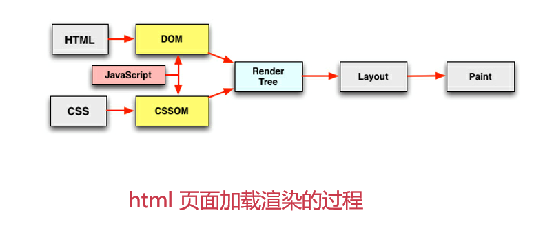
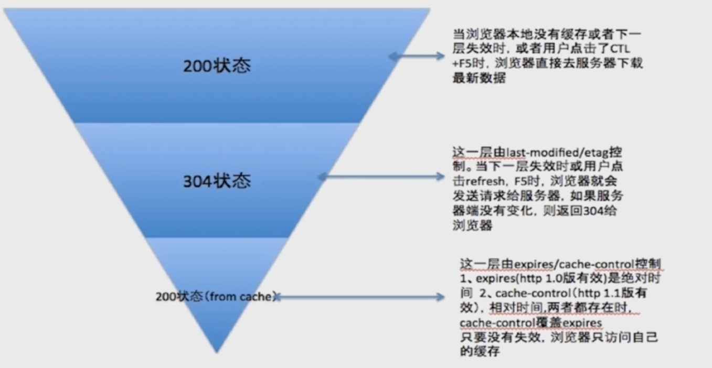
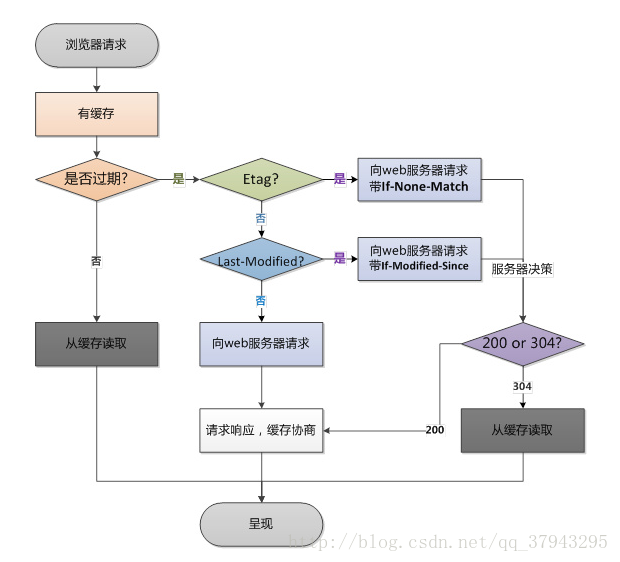

# 前端性能优化

**浏览器的一个请求过程的优化点**

- DNS 优化
- 网络请求优化
- 静态资源缓存
- 减少 http 请求次数和请求大小
- 使用服务端渲染方案

**深入理解 http 请求过程，是前端性能优化的核心**


## 资源的合并与压缩

涉及到的优化点：减少 http 请求数量、减少请求资源的大小

### html 压缩

html 实际上一个文本文件，经常会出现一些空格或者制表符或者注释，这些在实际显示时是无意义的，html 压缩的本质就是去除这些无意义的文本。

**如何进行 html 压缩**

1. 使用在线网站进行压缩
2. 使用 node.js 提供的 html-minifier 工具：设计到许多配置参数，可以在构建层或服务端进行 html 压缩
3. 后端模板引擎渲染压缩：可以在模板引擎渲染的方法中(比如 express 的 render 函数 )，在得到渲染后的 html 页面之后，调用 html-minifier 进行压缩


### css 压缩 

* **无效字符删除**：去除回车空格，无效字符，无效代码和注释

* **css 语义合并**：对出现语义重复的代码进行语义合并

**如何进行 css 压缩**

1. 使用在线网站进行压缩
2. 使用 html-minifier 对 html 中的 css 进行压缩
3. 使用 clean-css 对 css 进行压缩


### js 的压缩与混乱

* **无效字符的删除**

* **代码语义的缩减和优化**

* **代码保护**：js 代码是可以被访问网站的人看到的，js 压缩使代码风格变得混乱、不可读，做到对代码的保护。

**如何进行 js 压缩与混乱**

1. 使用在线网站进行压缩

2. 使用 html-minifier 对 html 中的 js 进行压缩
3. 使用 uglifyjs2 对 js 进行压缩

这三种在真实场景中都是结合构建工具来一起使用的


```
html 压缩可有可无，但是 css 和 js 的压缩是十分必要的，因为他们的代码量一般都比较多。
```


### 文件合并

文件合并主要是为了减少 http 请求次数，每次请求一个文件都发送一次 http 请求，会使得文件与文件之间有插入的上行请求，如果有 n 个文件，就增加了 n-1 的网络延迟。此外也会加重丢包的问题，而且经过代理服务器时还可能被断开(无法保持 keep-alive)

**如何进行文件合并？**

1. 使用在线网站进行文件合并
2. 使用 node.js 实现文件合并

**文件合并存在的问题**

* 首屏渲染问题：文件合并后的 js 文件会比较大，如果 html 页面渲染依赖于这个 js 文件的话，这时就要等到 js 文件请求回来之后才能进行。
* 缓存失效问题：一般 js 文件都会给其添加一个 md5戳 来标记 js 文件的改变并做缓存，如果将多个 js 文件合并的话，md5戳就没有了作用，缓存就会失效。

**文件合并的建议**

* 公共库合并：实际开发中业务代码是会经常变的，但一些公共库的代码基本是不变的。一般可以将公共库代码和业务代码分别打包成一个文件。
* 不同页面合并：不同页面的 js 文件要单独的打包


### 开启 gzip


## 图片相关优化

### 不同格式图片的业务场景

* jpg 有损压缩，相对 png 压缩率高，不支持透明，适合大部分不需要透明图片的业务场景
* png  支持透明，浏览器兼容性好，适合大部分需要透明图片的业务场景
* webp 谷歌推出的一种图片格式，压缩程度比 jpg 和 png 要好，在 ios webview 中有兼容性问题，适合用在安卓端开发
* svg  代码内嵌，质量高，相对较小，适合图片样式相对简单的场景(如 logo、icon)


### 与图片相关的优化方法

* **图片压缩**

  针对真实图片的情况，舍弃一些相对无关紧要的色彩信息，有效减少图片大小。

  http://tinypng.com

* **CSS 雪碧图**

  把网站用到的一些图片整合到一张图片中去，能减少网站的 http 请求数量。

  缺点：整合图片比较大时，一次加载比较慢

  http://spritecow.com

* **Image inline（常用）**

  将图片转成 base64 编码并内嵌到 html 页面中。即 html 页面的时候就已存在，不需要请求加载。能够有效减少 http 请求次数，但相对来说 html 会比较大，要根据具体的业务场景来权衡

* **使用矢量图（常用）**

  使用 SVG 提供的一些标签来进行矢量图绘制，不需要通过 http 请求去加载

* **在安卓下使用 webp**

  http://zhitu.isux.us


## CSS 和 Js 的装载与执行

### 网站在浏览器端的渲染过程

浏览器输入地址回车后，首先请求回 html 页面，通过浏览器先进行解析并声称 DOM树，在这个过程中如果遇到 link 或 script 等标签引入资源，便同时请求加载(CSS 或 js)，CSS 解析成 CSSOM，js 通过 V8 引擎去执行。DOM 和 CSSOM 解析完毕后结合成渲染树(Render Tree)，再进一步进行布局和绘制




### HTML 渲染过程的特点

#### 顺序执行，并发加载

* 顺序执行：从上到下按照词法分析解析标签
* 并发加载：在解析过程中遇到的 Web 资源是并发去请求加载的，在这里要注意同个域名下并发请求是有上限的

#### 阻塞

css 阻塞：

* css 在 head 中通过 link 引入会阻塞页面的渲染(等这个 css 资源加载完之后才会进行渲染，没毛病)
* css 在加载完之前，js 的执行会被阻塞(在逻辑上没有问题)，但不会阻塞 js 资源的加载

js 阻塞：

* 直接引入的 js 会阻塞页面的渲染(通过 async 引入就不会)
* js 不会去阻塞资源的加载
* js 是顺序执行的，会阻塞后续 js 的执行

#### 依赖关系

页面渲染依赖于css的加载 
js 执行顺序的依赖关系 
js逻辑对于dom节点的依赖关系

#### 引入方式

* css：link、import引入的区别

* script 中的 src 引入会有会有阻塞的问题，考虑使用 defer , async 标签，动态资源加载


### 相关优化点

* css 样式表置顶 
* 用 link 代替 import 
* js 脚本置底 
* 合理使用 js 的异步加载能力


## 懒加载与预加载

懒加载和预加载主要都是为了平衡利用浏览器资源的能力

### 懒加载

* 延迟加载，将加载时间点延后

* 当图片进入可视区域后再去请求图片资源
* 并发加载的资源过多，会阻塞 js 的加载，影响使用
* 减少无效资源的加载
* 适合图片很多，页面很长的业务场景

**实现懒加载的方式**

1. 监听 scroll 事件，在 scroll 的回调中去判断懒加载的图片是否进入了可视区(图片的上边缘是否触碰到了手机屏幕底部)

```js
var viewHeight = document.documentElement.clientHeight // 可视区域高度
function lazyLoad(){
    // 获取所有标记了 data-original 和 lazyload 的 img 图片
    var eles = document.querySelectorAll('img[data-original][lazyload]') 
    //遍历所有这些图片
    Array.prototype.forEach.call(eles,function(item,index){
        var rect;
        if(item.dataset.original === '') {
            return
        }
        rect = item.getBoudingClientRect();
        // 判断图片的上边缘距离屏幕顶部的高度是否已经小于可视区域的高度，是的话把data-original 里的值赋给 img 的 src，让图片加载
        if(rect.bottom >=0 && rect.top < viewHeight) {
			!function() {
                var img = new Image();
                img.src = item.dataset.url
                img.onload = function() {
                    item.src = img.src
                }
                item.removeAttribute('data-original')
                item.removeAttribute('lazyload')
            }()
        }
    })
}
// 手动调用一次 lazyload 来加载首屏的图片
lazyload()
// 注册滚动监听事件，触发 lazyload
document.addEvenListener('scroll',lazyload)
```

注意：需要预设图片的显示的高度，没有预设的话在图片还未加载的时候，全部的图片都会挤在首层

2. 使用 zepto 的 zepto.lazyload.js 插件


### 预加载

* 提前加载，将加载时间点提前
* 在图片等静态资源在使用前就请求，使得资源使用到时可以从缓存中加载，提升用户体验
* 有利于维护页面渲染的依赖关系（等资源加载完毕再渲染，如 loading 过程就是在等待资 源的加载）

**实现预加载的方式**

1. 通过设置 style:"display：none"，让图片加载但不显示

```html

```

2. 使用 js 创建 image 对象

```javascript
// 在执行完这段代码后就会去请求图片的资源
var image = new image();
image.src = "http://xxx.jpg"
```

3. 使用 XMLHttpRequest 对象

```
优点：能够对预加载的整个过程有个掌控
缺点：可能会有跨域问题
```

4. 使用 preload.js 库

```
preload.js 默认使用 XHR 对象来进行预加载，可能会遇到跨域问题
可以把参数设置为 false 来用标签的形式加载
```


## 浏览器的重绘与回流

### css 性能让 javascript 变慢

浏览器引擎中，css 的 UI 渲染线程和 JavaScript 的解析线程是两个单独的线程工作的，单独并发工作本来互不影响，但由于浏览器机制导致了这两个线程互斥，UI 线程渲染时 js 代码的执行是中止的，js 代码执行时 UI 渲染也是中止的。

**因此频繁触发渲染的流程( 重绘与回流 )，会导致 UI 频繁渲染，最终导致 js 变慢**

优化 css 性能，降低 UI 线程渲染的次数和难度，来加快渲染速度


### 回流

当涉及到页面大小的变化，尺寸的变化，布局的变化时，就会触发回流。

如页面下拉加载数据到 DOM 树上时，鼠标放上图片图片变大效果，

**触发回流的属性：**

* 盒子模型相关属性

```
width 
height
padding
margin
display
border-width
border
min-height
```

* 定位属性及浮动

```
top
bottom
left
right
position
float
clear
```

* 改变节点内部文字结构

```
text-align
overflow-y
font-weight
overflow
font-family
line-height
vertival-align
white-space
font-size
```


### 重绘

当元素需要更新一些影响元素外观、风格的属性，而不是影响布局的属性时，就会触发重绘。

如改变字体颜色，背景颜色等

**触发重绘的属性：**

```
color
border-style
border-radius
visibility
text-decoration
background
background-image
background-position
background-repeat
background-size
outline-color
outline
outline-style
outline-width
box-shadow
```


**回流必定会引起重绘，但重绘不一定会引起回流**


### 图层

**频繁重绘回流**的DOM元素单独作为一个**独立图层**,那么这个DOM元素的重绘和回流的影响只会在这个**图层**中

**如何创建图层**

- 3D或透视变换（perspective transform）CSS属性
- 使用加速视频解码的 <video> 节点
- 拥有3D（WebGL）上下文或加速的2D上下文的 <canvas> 节点
- 混合插件（如Flash）
- 对自己的opacity做CSS动画或使用一个动画webkit变换的元素
- 拥有加速CSS过滤器的元素
- 元素有一个包含复合层的后代节点（一个元素拥有一个子元素，该子元素在自己的层里）
- 元素有一个z-index较低且包含一个复合层的兄弟元素（换句话说就是该元素在复合层上面渲染）


### 如何避免重绘和回流

* 避免使用触发重绘和回流的 CSS 属性
* 将重绘和回流的影响返回限制在**单独的图层**内

```
chrome 控制台的 performance 查看浏览器绘制过程 ，layers 查看网页图层数量
```


### 优化点

* **translate 替代 top**

  top 会触发回流但是 translate 不会

* **opacity 替代 visibility**

  visibility 会触发重绘，不触发回流，opacity 都不会触发。

* **不要一条条的修改dom样式**，而是写一个 class 来修改 dom 的 className

* **把 DOM 离线后修改**

  比如：先把 DOM 给 display:none (有一次 Reflow)，然后你修改100次，然后再把它显示出来。

* **不要把 DOM 结点的属性值放在一个循环里当成循环里的变量**

  比如offsetHeight offsetWidth

* **不使用table，table 部分的改变会引起整个 table 的重绘。**而 div 只会影响所改变之后的，不会影响之前的

* 动画实现的速度的选择

  比如设置个 1ms 就动一次消耗十分大)

* 对于动画要告知 chrome 新建图层。

* **启用GPU硬件加速**

  启用 GPU 能够加快渲染速度

  CPU 到 GPU 传输需要时间，多个元素启用GPU加速，大量时间会花在图层合成

  **开启 GPU 加速可以使用 translate3D 属性**


## 浏览器存储

### Cookie

cookie 的设计初衷是因为 http 的请求是无状态的，即用户第一次访问站点后，第二次访问时无法确认用户之前访问过站点。cookie 主要用来去维持客户端的状态。

**目前 cookie 的主要作用有：**

* **用于维护客户端和服务端的用户状态(主要)**

* **客户端自身数据的存储(逐渐被 localstorage取代)**

**cookie 生成方式：**

* 服务端 http response header 中 set-cookie

* js 中可以通过 document.cookie 来读写 cookie

**cookie 的存储限制：**

* 大小在 4KB 左右
* 需设置过期时间：expire

```
httponly 是 cookie 的一个重要的属性，表示不支持 js 读写，一般 cookie 存放的是比较重要的用户信息，如果支持 js 读写很容易就会被攻击（chrome 里某个 cookie 的 http 选项打上勾）
```

**优化点：**

* **cdn 的流量损耗**

> cookie 是一个域名维度下的概念，**只要是同一个域名下的所有请求，就都会携带上 cookie**，但 cookie 主要是用来维护用户信息的，请求某些静态文件的时候是不需要用户信息的(不用携带 cookie)，因此就会带来不必要的流量损耗。

解决办法： **cdn 的域名和主站的域名分开**


### LocalStroage

LocalStroage 是 H5 设计出来专门用于浏览器存储的，有以下特点

* 大小为 5M 左右
* 仅在客户端使用，不和服务端进行通信
* 接口封装较好(在 js 中有较好的 api 封装)

**优化点：**

浏览器本地缓存方案


### SessionStorage

* 会话级别存储(一个网页)
* 大小为 5M 左右
* 仅在客户端使用，不和服务端进行通信
* 接口封装较

对表单信息的维护：比如表单未填完时刷新页面，表单之前的数据也会被清空。可以通过 sessionstorage 来提升用户体验


### IndexDB

> Index DB 是一种低级 API ，用于客户端存储大量结构化数据。该 API 使用索引来实现对数据的高性能搜索。 IndexDB 为 localstorage 无法存储大量结构化数据提供了一个解决方案，可以为应用创建离线版本


```javascript
window.indexDB
function openDB(name) {
	// 建立打开 indexDB
    var request = window.indexDB.open(name)
	// 操作 indexDB
	request.onerror = function(e){} // 失败回调
	request.onsuccess = function(e){
       myDB.db = e.target.result
       console.log(myDB.db) // 返回一个 db 对象
    } // 成功回调
}
var myDB = {
    name:'test',
    version:'1.0.0',
    db:null
}
openDB(myDB.name)
```


### Service Worker

> Service Worker 是要给脚本，它独立于当前网页，浏览器将它放在后台运行，让一些不依赖页面或者用户交互的特性

应用点：

* 使用拦截和处理网络请求的能力，去实现一个离线应用
* 使用 Service Worker 在后台运行同时能和页面通信的能力，去实现大规模的后台数据处理

service worker 检查：

* chrome://serviceworker-internals/
* chrome://inspect/#service-workers

```javascript
// 注册 sw
if(navigator.serviceWorker) {
    navigator.serviceWorker.register('./service-worker.js',{scope:'./'})
     .then(function (reg) { // 注册 sw 成功回调
        console.log(reg)
    })
    .catch(function (e) {
        console.log(e) // 失败信息
    })
}else {
    altert('Service Worker is not defined')
}
// service-worker.js
// 监听 sw 的 install 事件
self.addEventListener('install',function(e) {
    e.waitUntil( // 在等待 promise 对象返回之前做的操作
    	caches.open('app-v1').then(function(cache) { // 开启cache storage
            console.log('open cache')
            return cache.addAll(['./app.js','./main.css ']) // 把文件放入cache 中
        })
    )
})
// 在主页面中监听 fetch 事件监听所有向网络发送的请求然后拦截下来
self.addEventListener('fetch',function(event) {
    event.respondWith( // 通过这个方法来改变返回值
    	caches.match(event.request)  //读缓存 
        	.then(function(res) {
                if(res) { // 缓存中有就返回
                    return res
                }else {
                    // 缓存中没有就通过 fetch 方法向网络发起请求
                    fetch()
                }
            })
    )
})
```

**Service Worker 主页面间通信**


### PWA 

> PWA (Progressive Web App 渐进式 Webapp) 是一种 Web App 新模型，它不是一种技术或知识点，是通过一系列新的Web特性，配合优秀的 UI 交互设计，逐步增强 Web App 的用户体验

* 可靠

  没有网络时也能提供基本的页面访问，不会出现未连接到互联网的页面

*  快速

  针对网页渲染及网络数据访问有较好的优化(网页渲染及数据访问或 UI 交互都能达到原生 APP 的效果)

* 融入

  应用可被增加到手机桌面，并和普通应用一样有全屏和推送等特性

如何检测是不是 PWA

使用谷歌性能检测工具 lighthouse


## 浏览器缓存策略

### httpheader

* **Cache-Control**

  可以出现在 response header 中也可以出现在 request header 中，让客户端和服务端相互知道缓存策略的情况，有以下属性：

  * max-age：缓存的最大有效时间，在这个有效时间中某个资源不会再向服务端发起请求
  * s-maxage：和 max-age 一样，区别是它只能缓存 public 的资源，且比 max-age 优先级要高，会返回 304
  * private ：比如只能是当前用户才能访问的缓存
  * public ：能被很多用户访问并读取的，网站公共资源的缓存，如 cdn
  * no-cache：max-age 会直接去浏览器中读取缓存，no-cache 则会向浏览器发起一次请求，询问当前资源在缓存中是否过期，同时他会向服务端发送请求，根据返回的 lastmodified 来进一步判断需要使用什么缓存策略
  * no-store：不使用任何缓存

* **Expires**

  用来指定缓存的过期时间点，是服务器端的具体时间点，告知浏览器在过期时间前都可以直接从浏览器缓存取数据而无须发起请求

  max-age 优先级高于 expires

```
使用 expires 和 max-age 都属于强缓存机制，因为他们都是直接从浏览器缓存读取相应数据而不会向服务端发起请求，无法感知到服务端的变化
```


* **基于客户端和服务端的协商缓存机制**

  * **response header — Last-Modified**

    表示某个资源在服务端最后修改的时间点，写在服务端返回的 response header 中

  * **request header — If-Modified-since**

    向服务端发起对某个资源的请求时在 request header 中写下 if-modified-since，它的值是这个资源之前从服务端返回的 last-modified，以此来判断服务端中这个资源是否已被修改，若没有被修改，则返回 304，从缓存读取；若已被修改，则服务端返回最新的资源并更新资源的 last-modified ，返回 200

```
和 cache-control 共同使用时，若配置了 max-age，会优先走 max-age，即强缓存
第一次请求不会带上 if-modified-since
```

```
* last-modified 的缺点
1. 某些服务端不能获取精确的修改时间
2. 文件修改时间改了，但文件内容没有变
```


* **ETag 和 If-None-Match**

  * **response header — ETag**

    实际上是服务端返回的一个文件内容的 hash 值，当文件内容改变时， hash 值也会跟着变化

  * **requeset header — If-None-Match**

    与 If-Modified-Since 类似

```
ETag 比 last-modified 更加精确，且优先级更高
优先级 ： max-age  >  expire  > ETag  >  last-modified
```


### 分级缓存策略






## 服务端性能优化

### Vue 渲染的问题

* 没有框架时，用 jsp / php 在服务端进行数据的填充，发送给客户端就是已填充好数据的 html
* 有框架后，由于页面渲染依赖到框架核心代码，需要等框架加载完，再去渲染页面，即直接在客户端执行编译。导致首屏渲染的问题


### 在 Vue 基础上进行优化

多层次的优化方案

* 构建层模板编译

  Vue 2.0 把 Vue 拆成了 compiler(模板编译) 和 runtime(运行时) 两个层面，可以在 webpack 构建打包时先进行 complier 模板编译，再把编译好的文件放入 runtime 中运行

* 数据无关的 prerender 方式

* 服务端渲染

  利用服务端的计算能力，将编译渲染放在服务端运行然后返回给客户端

  